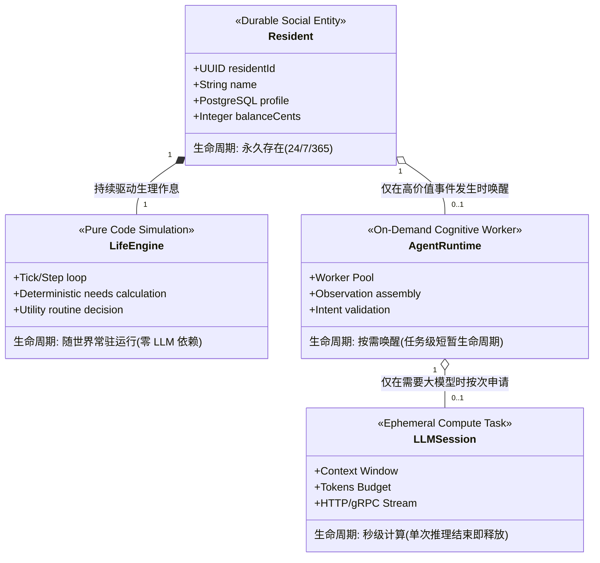

# 03 - 实体解耦模型与 Agent 唤醒架构 (Agent Runtime Model & Wake Patterns)

## 1. 概念澄清：Resident ≠ Life Engine ≠ Agent Runtime ≠ LLM Session

在许多未经过严肃工程论证的 Agent Demo 中，开发者往往不假思索地建立如下等式：
$$\text{Resident (数字居民)} \equiv \text{Agent Process (常驻进程)} \equiv \text{LLM Session (长连接会话)}$$

这种将“社会身份”、“模拟引擎”、“计算容器”与“模型会话”混为一谈的设计，是导致系统在实体规模超过 50 人时发生内存枯竭、调度瘫痪与成本雪崩的元凶。

在「镜界」持久数字社会中，必须明确切分四者的职责与生命周期：



### 1.1 四层实体的精准定义与生命周期

1. **Resident (居民 - 永久持久化社会实体)**：
   - **本质**：数据库中的一组不可磨灭的业务记录（PostgreSQL 行数据）。包含社会身份、法定账户、所有权、物理坐标、人格基础设定。
   - **生命周期**：持久长存。即便整个服务器集群关机重启，居民依然客观存在于持久化事实中。
2. **Life Engine (生命引擎 - 确定性连续物理与作息机能)**：
   - **本质**：负责驱动居民日常生理驱动力（饥饿、疲劳、精力）、按时间表上班、睡觉、通勤的**纯代码确定性逻辑**（M3 范围）。
   - **生命周期**：与世界主循环同频常驻。计算极快（微秒级），纯函数，不需要任何外部网络 IO，**零 LLM 消耗**。
3. **Agent Runtime (智能体运行时 - 按需无状态认知执行环境)**：
   - **本质**：由集中式 Worker 工作池组成的无状态异步执行器。仅当居民遇到突发事件、不确定冲突或人机直接交互时，才会被临时调度分配。
   - **生命周期**：任务级短暂生命周期（毫秒至数秒）。完成一次观察装配、意图解析与请求提交后，Worker 立即归还池中，内存彻底回收。
4. **LLM Session (大模型会话 - 瞬态计算资源)**：
   - **本质**：发送给大模型提供商（OpenAI/Claude/DeepSeek）的一次性 HTTP 请求与返回流。
   - **生命周期**：秒级瞬态计算。单次调用完成后，上下文即刻销毁，持久心智沉淀完全交由 M4 记忆引擎，**绝不长期保持常驻长连接会话**。

---

## 2. 居民是否需要永久 Agent Process？——成本与架构死刑宣判

> **架构结论：绝不需要！镜界永久禁止为每个居民启动独立的永久守护进程（Permanent Daemon Process）。**

### 2.1 理论与工程推演证据

若为每个居民分配一个常驻进程（如独立的 Node.js 进程、Python 线程或常驻容器）：

| 规模 (居民数) | 常驻进程方案内存消耗 (按单进程 200MB 计)    | 线程与调度开销 (OS 线程 / Event Loop)  | 数据库连接消耗 (按每进程 2 连接计) | 结论                        |
| :------------ | :------------------------------------------ | :------------------------------------- | :--------------------------------- | :-------------------------- |
| **30**        | $30 \times 200\text{MB} = 6\text{ GB}$      | 30 个事件循环，CPU 尚可负载            | 60 连接，单机 PG 勉强支撑          | 勉强可用但极其浪费          |
| **100**       | $100 \times 200\text{MB} = 20\text{ GB}$    | 100 个事件循环，上下文切换损耗增大     | 200 连接，逼近通用 PG 默认阈值     | 资源严重浪费                |
| **1,000**     | $1,000 \times 200\text{MB} = 200\text{ GB}$ | 1,000 个事件循环，系统调度发生剧烈抖动 | 2,000 连接，连接池瞬间打爆         | **系统崩溃 (FATAL)**        |
| **10,000**    | $10,000 \times 200\text{MB} = 2\text{ TB}$  | 数万线程，OS 调度完全锁死              | 数万并发连接，数据库直接宕机       | **物理不可行 (IMPOSSIBLE)** |

### 2.2 反对永久进程的核心理由：

1. **活动低峰期资源空耗（95% 的时间居民处于 Routine 状态）**：一个居民在上班打字、深夜睡觉或坐地铁通勤时，其行为完全由 Life Engine 规则驱动，常驻的 Agent 进程在 95% 的时间里纯属浪费服务器内存。
2. **状态无法水平扩展与弹性容灾**：常驻进程将“运行时状态”保存在单机内存中。一旦某台机器崩溃，这批居民的“心智”将由于缺少持久化而产生精神断层；相反，**无状态 Worker 池（Stateless Worker Pool）**结合 PostgreSQL，可以在任何机器崩溃时零感知漂移。
3. **确定性重放被彻底瓦解**：1,000 个独立常驻进程拥有各自的物理时钟和随机数生成器，由于线程竞争的不确定性，整个世界的模拟过程无法通过固定 Seed 重放。

---

## 3. 五种 Agent 唤醒模型深度对比

为了确定何时以及如何调动认知算力，我们对业内存在的五种唤醒方案进行全维度对比：

- **方案 A：单居民常驻进程 (Permanent Process per Resident)**：每个居民启动长期常驻进程。
- **方案 B：高频轮询唤醒 (Polling Agent)**：所有居民以固定周期（如每 5 秒）轮询世界状态判断是否需要思考。
- **方案 C：纯事件驱动唤醒 (Pure Event-Triggered Wake)**：仅当附近发生物理/社交事件时唤醒。
- **方案 D：计划性定时唤醒 (Scheduled Wake)**：由日程规划表在特定时间点（如准点决策）唤醒。
- **方案 E：混合事件+计划+按需唤醒 (Hybrid: Event + Schedule + On-Demand) —— 推荐方案**。

### 3.1 跨规模（30 / 100 / 1,000 / 10,000 居民）综合对比矩阵

| 评估维度               | 方案 A (常驻进程)          | 方案 B (高频轮询)       | 方案 C (纯事件驱动) | 方案 D (纯计划定时) | 方案 E (推荐混合架构)                   |
| :--------------------- | :------------------------- | :---------------------- | :------------------ | :------------------ | :-------------------------------------- |
| **内存占用 (Memory)**  | 极高 ($O(N)$，10K人需 2TB) | 低 (集中式轮询器)       | 极低 (按需 Worker)  | 极低 (轻量定时器)   | **极低且弹性 ($O(\text{并发任务数})$)** |
| **CPU 负载 (CPU)**     | 极高 (海量上下文切换)      | 极高 (99% 无效读库)     | 波动较大 (事件风暴) | 均匀平稳            | **极平稳 (削峰填谷 + 优先级缓冲)**      |
| **LLM 调用量 (Calls)** | 泛滥失控 (容易瞎思考)      | 灾难级 (频繁无意义思考) | 中等偏高 (连锁反应) | 过于死板 (错过突发) | **极低且精准 (仅高价值事件思考)**       |
| **队列积压 (Queue)**   | 无全局队列，散落各进程     | 队列容易被轮询打爆      | 突发事件时瞬时突增  | 峰值可预期          | **健康受控 (多车道背压与熔断)**         |
| **感知延迟 (Latency)** | 瞬时反应但伴随锁竞争       | 延迟取决于轮询间隔      | 毫秒级快速响应      | 只能到点响应        | **毫秒级响应 (核心交互优先)**           |
| **运维复杂度 (Ops)**   | 灾难级 (死进程治理难)      | 简单但浪费钱            | 中等 (依赖事件流)   | 简单                | **成熟工业级 (基于消息队列与池化)**     |
| **30 人场景评价**      | 勉强能跑，开发简单         | 浪费但能跑              | 反应灵敏，开销小    | 反应迟钝            | **极轻量运行，零浪费**                  |
| **100 人场景评价**     | 机器配置要求高             | 数据库慢查询告警        | 运行良好            | 互动僵硬            | **极佳性价比，稳定**                    |
| **1,000 人场景评价**   | **服务 OOM 崩溃**          | **数据库被查垮**        | 偶发连锁唤醒雪崩    | 缺乏突发生机        | **通过 LOD 与并发控制稳健支撑**         |
| **10,000 人场景评价**  | **绝对不可行**             | **绝对不可行**          | 需严格事件降采样    | 纯静态假人          | **90% 居民确定性运行，核心活灵活现**    |

---

## 4. 推荐架构：方案 E 混合按需唤醒机制

镜界最终采纳**方案 E：混合唤醒模型（Hybrid Wake Architecture）**，由三大触发源统一汇入 **`AgentWakeRouter`**：

```text
       [ 触发源 1: 计划定时调度 (Schedule Wake) ] ───► 日程时间节点 (如工作交接、计划检视)
                                                              │
       [ 触发源 2: 世界事件刺激 (World Event Wake) ] ────► 遭遇突发 (如他人打招呼、遭遇降薪、火警)
                                                              │
       [ 触发源 3: 用户交互按需 (On-Demand Wake) ] ──────► 玩家靠近对话、点击交互 (最高优先级)
                                                              │
                                                              ▼
                                                   [ AgentWakeRouter 智能路由器 ]
                                                              │
                                            (1) 过滤: 居民当前是否处于不可打扰态 (如深度睡眠)?
                                            (2) 门禁: 检查 Intelligence LOD 等级与预算?
                                            (3) 校验: Life Engine 是否已能直接确定性处理?
                                                              │
                                         ┌────────────────────┴────────────────────┐
                                         ▼                                         ▼
                               [ Life Engine 本地消化 ]                 [ 组装 AgentOperation ]
                             (零 LLM 调用, 纯代码推进)                             │
                                                                                   ▼
                                                                        [ 投递至 BullMQ 优先级通道 ]
```

### 唤醒决策的确定性守门规则：

1. **不可打扰态免唤醒**：若居民在世界中的状态是 `SLEEPING`，除 `RESIDENT_INJURED` 等灾难级事件外，自动忽略所有普通社交与对话唤醒，直接返回，不消耗任何算力。
2. **生命周期单并发原则（Single Operation per Resident）**：每个居民在同一物理时间只允许存在**一个正在执行中的认知操作（Active Operation）**。若上一轮思考未完成，新事件只能更新其待观察缓冲，绝不重复启动第二个并行思考任务。
