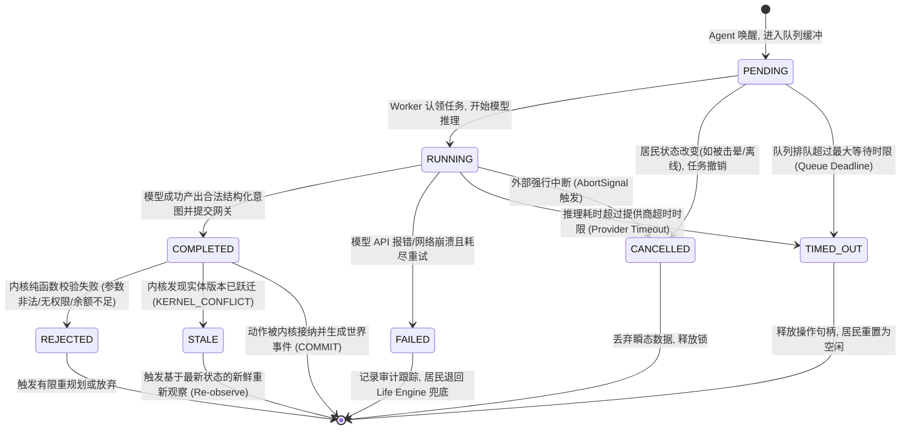

# 06 - 认知操作生命周期状态机 (Agent Operation Lifecycle)

## 1. 为什么世界不能等待 Agent 思考？

在传统同步架构中，如果世界主循环在执行某个居民动作时同步调用外部大模型：

```typescript
// 严禁的致命反模式：阻塞世界主循环
for (const resident of residents) {
  const intent = await llmProvider.generateIntent(resident); // 耗时 3~10 秒！
  kernel.execute(intent);
}
```

其后果是灾难性的：只需一个居民的模型调用出现网络抖动（耗时 15 秒），整个世界上千名居民的所有物理位移、时钟推进与交互将全部停摆冻结 15 秒。

因此，镜界吸收并超越了 AI Town 的 `inProgressOperation` 机制，确立了：

> **世界时钟单调向前，主模拟循环毫秒级流转；Agent 的一切思考都是后台异步的独立操作（Agent Operation）。**
> **居民在思考期间处于“沉思/犹豫”状态，世界物理继续推进；思考完成后以带版本栅栏的离散请求重新接入内核。**

---

## 2. 认知操作生命周期状态机 (State Machine)

一个完整的 `AgentOperation` 从被唤醒触发到最终收敛，经历严格的状态转移图：



---

## 3. 各状态权威语义定义

| 状态枚举        | 状态中文名   | 触发条件与核心语义                                                                         | 对物理世界的影响                                      |
| :-------------- | :----------- | :----------------------------------------------------------------------------------------- | :---------------------------------------------------- |
| **`PENDING`**   | **就绪排队** | 唤醒请求通过校验，写入 BullMQ 队列等待 Worker 认领。居民状态打上 `inProgressOperationId`。 | 无影响。居民在世界中继续执行前序惯性动作。            |
| **`RUNNING`**   | **正在思考** | Worker 线程组装完观察快照，持有 `AbortController` 正在向 LLM 发起 HTTP 调用。              | 无影响。居民表现为“正在沉思 / 略作迟疑”。             |
| **`COMPLETED`** | **推理完成** | LLM 成功返回，通过 Schema 校验并生成了合法的 `ActionIntent`，已向 Gateway 提交。           | 无影响。等待内核事务裁决。                            |
| **`FAILED`**    | **执行失败** | Provider 持续返回 HTTP 5xx、429 或返回不可修复的乱码，重试耗尽。                           | 居民本次高阶意图流产，退回 Life Engine 本地默认动作。 |
| **`TIMED_OUT`** | **操作超时** | 排队超时（排队 > 15s）或大模型推理超时（耗时 > 12s），系统触发 `abort()` 熔断。            | 强制清理居民操作标记，防止居民永久“卡死发呆”。        |
| **`CANCELLED`** | **主动取消** | 居民在思考期间遭遇不可逆状态剧变（如被击晕、被拘捕、强制下线），操作被作废。               | 操作静默销毁，忽略后续一切返回。                      |
| **`STALE`**     | **快照陈旧** | 意图送达内核时，内核发现 `expectedActorVersion !== currentActorVersion`。                  | 内核拒绝执行并返回 `KERNEL_CONFLICT`，防范脏写入。    |
| **`REJECTED`**  | **内核拒绝** | 意图送达内核时，发现业务条件不满足（如资金被扣光、目的地不可达）。                         | 动作未执行，记录失败原因码，供下一次观察读取。        |

---

## 4. 避免世界线程等待的四大铁律

1. **零事务挂起（No Transaction Across Async Boundary）**：
   - 严禁在开启任何数据库连接事务或持有行锁的情况下，进入 `PENDING` 或 `RUNNING` 状态。
2. **居民单活跃操作互斥（Single Flight Guard）**：
   - 每个居民在内存状态或 Redis 投影中维护 `activeOperation: { id, type, startedAt, timeoutAt } | null`。
   - 当 `activeOperation !== null` 时，拒绝任何重复的并发唤醒（除非新事件是紧急取消信号）。
3. **主动看门狗心跳（Operation Watchdog）**：
   - 调度器每秒运行轻量看门狗，扫描处于 `RUNNING` 状态但已超过 `timeoutAt` 的操作。
   - 一旦超时，立即调用 `abortSignal.abort()` 释放连接，并将状态标为 `TIMED_OUT`，清空居民挂起标记。
4. **迟到结果丢弃（Late Completion Drop）**：
   - 若模型提供商在超时被取消后依然返回了数据，Worker 检查发现该 Operation 已被标记为 `TIMED_OUT` 或 `CANCELLED`，立即静默丢弃其结果，绝不向内核提交迟到的动作请求。
