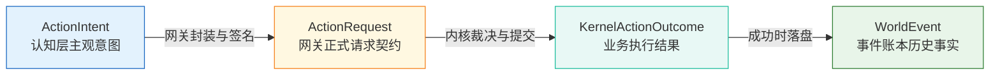

# 08 - 结构化意图规范与三层校验防线 (Structured Intent & Validation)

## 1. 为什么自然语言绝不能直接成为世界事实？

在某些设计简陋的 AI 原型中，常有如下伪代码：

```text
LLM 输出: "林默走进了蓝瓶咖啡店，然后买了一杯 35 元拿铁。"
系统处理: 将该字符串直接广播给前端，或粗暴调用正则提取更新数据库。
```

这种模式在工业级数字社会中存在致命缺陷：

1. **语义歧义与不可计算性**：大模型文本中可能包含假设语气、隐喻或调侃（例如：“我恨不得把这整家店买下来”），无法被物理引擎与经济账本作为可信凭据解析。
2. **凭空违规与作弊**：大模型容易产生幻觉（如虚构一个不存在的“星空特调咖啡”，或定价为 -10 元），若无强类型结构约束，将导致数据库底层约束报错或经济系统逻辑溢出。
3. **不可重放与不可审计**：自然语言无法建立明确的参数指纹（Fingerprint）与幂等哈希，重放时极易产生不确定性发散。

因此，**大模型的输出必须被严格约束为结构化意图（Structured Intent）**。

---

## 2. 四大概念实体的严格界限与区分矩阵

必须在认知层、网关层、内核层与事件溯源层之间建立清晰的概念隔离：

$$\text{ActionIntent} \ne \text{ActionRequest} \ne \text{ActionResult} \ne \text{WorldEvent}$$



| 概念实体                  | 所处层级                   | 概念性质与核心属性                                                                                                 | 是否持久化？                               | 能否由 LLM 直接生成？                  |
| :------------------------ | :------------------------- | :----------------------------------------------------------------------------------------------------------------- | :----------------------------------------- | :------------------------------------- |
| **`ActionIntent`**        | **认知层 (Agent Runtime)** | **主观期望**。包含模型对当前世界做出的行为决策、可信度评分与分类归因。                                             | 否 (瞬态，仅存内存/Trace)                  | **是 (由 LLM 输出并通过 Schema 提取)** |
| **`ActionRequest`**       | **网关层 (World Gateway)** | **正式请求契约**。给意图赋予唯一 `idempotencyKey`、`traceId`、`requestedBy: "AI"` 及 `expectedActorVersion` 栅栏。 | 是 (写入 `action_requests` 表用于幂等防重) | **否 (由网关代为封装签名)**            |
| **`KernelActionOutcome`** | **内核层 (World Kernel)**  | **业务裁决结果**。内核事务对请求判定后的即时反馈（`ACCEPTED` / `REJECTED` / `CONFLICT`）。                         | 可选 (作为请求执行状态写回)                | **否 (由内核纯代码裁决)**              |
| **`WorldEvent`**          | **事实层 (Event Ledger)**  | **客观历史真理**。动作被内核接纳后，世界状态发生变更并追加到不可变事件流（`world_events`）。                       | **是 (PostgreSQL 绝对不可变账本)**         | **绝对不能！**                         |

---

## 3. ActionIntent 概念结构规范

```typescript
/**
 * Agent Runtime 认知层产出的结构化意图
 * 纯概念规范：严格拒绝混入私有思考链 (Chain-of-Thought)
 */
export interface ActionIntent {
  /** 意图全局唯一标识 (UUID v4) */
  readonly intentId: string;
  /** 发起意图的居民 ID */
  readonly residentId: string;
  /** 所属世界 ID */
  readonly worldId: string;

  /** 关键版本栅栏：该意图基于哪个快照版本得出 */
  readonly basedOn: {
    readonly actorVersion: number;
    readonly worldSeq: number;
    readonly worldTime: string;
  };

  /** 核心动作类型 (严格对齐 Action Contract) */
  readonly actionType: "MOVE" | "EAT" | "SLEEP" | "WORK" | "TALK" | "BUY";

  /** 强类型参数载荷 (与 packages/contracts/action-contract.ts 严格匹配) */
  readonly parameters:
    | { readonly destinationId: string } // MOVE
    | { readonly itemId: string; readonly quantity: number } // EAT
    | Record<string, never> // SLEEP
    | { readonly workplaceId: string } // WORK
    | { readonly participantId: string; readonly message?: string } // TALK
    | { readonly itemId: string; readonly quantity: number }; // BUY

  /** 意图置信度 (0.00 ~ 1.00) */
  readonly confidence: number;

  /** 分类归因码 (标准化枚举，严禁保存非结构化思维链文本) */
  readonly reasonCategory:
    | "NEED_SATISFACTION" // 满足饥饿/疲劳生理需求
    | "SCHEDULE_WORK" // 上下班履职
    | "SOCIAL_ENGAGEMENT" // 社交与对话
    | "ECONOMIC_TRADE" // 物品购买
    | "ESCAPE_CONFLICT" // 避险与远离冲突
    | "ROUTINE_WANDER"; // 漫步

  /** 世界时间过期时限 (可选：超过该世界时间则此意图不再具有执行意义) */
  readonly expiresAtWorldTime?: string;
}
```

---

## 4. 三层校验防线架构 (Three-Tier Validation Architecture)

任何来自大模型的结构化输出，在进入 World Kernel 之前必须依次穿过三道坚固的门禁。

```text
[ LLM Raw Response (JSON String) ]
                 │
                 ▼
┌────────────────────────────────────────────────────────┐
│ 第一道门禁: Schema 结构校验 (Schema Validation)        │
│ - 工具: Zod 严格模式 (.strict(), 拒绝未知字段)          │
│ - 检查: 类型是否正确? UUID是否合法? 枚举值是否越界?    │
│ - 失败: 触发局部 JSON 修复或 1 次受限重试               │
└────────────────────────────────────────────────────────┘
                 │
                 ▼ (Pass)
┌────────────────────────────────────────────────────────┐
│ 第二道门禁: 权限与沙箱校验 (Permission Validation)      │
│ - 检查: 该 Resident 当前是否被赋予执行此 Action 的权限? │
│ - 检查: requestedBy 是否合法为 "AI"?                   │
│ - 检查: 拟支配金额是否超过当前 Operation 的资金沙箱限额?│
│ - 失败: 直接判定非法，终止流程, 记入安全告警           │
└────────────────────────────────────────────────────────┘
                 │
                 ▼ (Pass)
┌────────────────────────────────────────────────────────┐
│ 第三道门禁: 业务预检与前置过滤 (Pre-flight Validation)  │
│ - 检查: 目标 LocationId 在当前局部快照中是否存在?       │
│ - 检查: 欲购买的 Item 是否在当前商店上架?               │
│ - 检查: 居民自身的可用现金余额是否足以支付单价×数量?   │
│ - 失败: 拦截非法请求, 触发基于观察的重规划 (Replan)     │
└────────────────────────────────────────────────────────┘
                 │
                 ▼ (Pass)
[ 生成正式 ActionRequest 提交至 World Gateway ]
```

### 关键防线原则：

1. **严禁 Agent Runtime“自作聪明”地修补非法意图**：
   - 若大模型输出了负价格（`priceCents = -100`）或不存在的地点，Agent Runtime 绝对不允许“偷偷改成 0 元”或“随机挑个合法地点发过去”。
   - 违规意图必须被如实标记为校验失败；
   - 系统可以给予其**最多 1 次（Bounded Re-prompt）**携带错误原因的重新规划机会；若再次失败，立即强制退回 Life Engine 的确定性动作。
2. **世界内核拥有最终裁决权**：
   - 即使通过了前置三道门禁，World Kernel 在执行事务提交前仍会以排他行锁重新复核所有物理和经济事实，彻底阻断任何 TOCTTOU（Time-of-Check to Time-of-Use）并发空隙。
