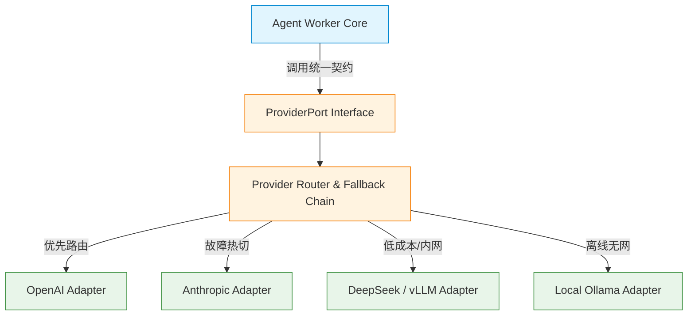

# 12 - 统一模型提供商端口抽象架构 (Provider Abstraction)

## 1. 架构隔离原则：严禁外部 SDK 类型污染核心领域

在许多开源项目中，经常看到直接将 OpenAI 或 Anthropic SDK 的私有类（如 `ChatCompletionMessageParam`、`OpenAI.APIError`、`tool_calls`）直接贯穿传递到业务核心层、游戏实体甚至数据库存储层的反模式。

在「镜界」持久数字社会中，确立如下架构底线：

> **World Kernel、Resident 实体与 Action Contract 严禁直接依赖任何特定商业 LLM SDK！**
> **所有与大模型提供商的通信必须收敛在 M5 基础设施层独立的 `ProviderPort` 端口之后。外部 SDK 的数据结构必须在端口边界被彻底翻译为镜界标准的强类型领域契约。**

---

## 2. Provider Port 概念端口契约设计

```typescript
/**
 * 镜界统一模型提供商端口概念契约 (ProviderPort)
 * 纯概念规范：严格隔离特定厂商 SDK 依赖
 */

export type ModelCapabilityTier =
  | "TIER_1_LIGHT" // 轻量小模型 (如 8B 本地模型, Flash-Lite)
  | "TIER_2_STANDARD" // 标准中端模型 (如 Haiku, Gemini Flash)
  | "TIER_3_ADVANCED" // 旗舰前沿模型 (如 Sonnet, GPT-4o)
  | "TIER_EMBEDDING"; // 向量化专用模型

export type ProviderErrorCategory =
  | "RATE_LIMIT_EXCEEDED" // HTTP 429 配额用尽
  | "CONTEXT_LENGTH_EXCEEDED" // 上下文超限
  | "AUTHENTICATION_FAILED" // 密钥或鉴权失败
  | "PROVIDER_DOWNTIME" // 500/502/503 服务故障
  | "TIMEOUT" // 超过客户端设置的超时时限
  | "CONTENT_POLICY_VIOLATION" // 触碰提供商安全策略拦截
  | "SCHEMA_GENERATION_FAILED" // 结构化输出失败/乱码
  | "UNKNOWN_NETWORK_ERROR"; // 底层 TCP/TLS 异常

export interface ModelUsageMetrics {
  readonly promptTokens: number;
  readonly completionTokens: number;
  readonly totalTokens: number;
  readonly costUnits: number; // 规范化成本单位，方便多模型统一核算
}

export interface ModelExecutionMetadata {
  readonly providerName: string; // "openai" | "anthropic" | "deepseek" | "ollama"
  readonly modelIdentifier: string; // 实际调用的具体模型字符串
  readonly latencyMs: number; // 物理往返耗时
  readonly finishReason: "stop" | "length" | "tool_calls" | "error";
}

export interface ModelStructuredRequest<TSchema> {
  readonly operationId: string;
  readonly residentId: string;
  readonly targetTier: ModelCapabilityTier;
  /** 经过 Context Composer 裁剪压缩的提示词结构 */
  readonly messages: readonly {
    readonly role: "system" | "user" | "assistant";
    readonly content: string;
  }[];
  /** 期望结构化输出的 Schema 定义 (由 Zod 抽象包装) */
  readonly responseSchema: TSchema;
  /** 超时与控制信号 */
  readonly abortSignal?: AbortSignal;
  readonly maxTokens?: number;
  readonly temperature?: number;
}

export interface ModelStructuredResponse<TData> {
  readonly success: true;
  readonly data: TData; // 严格符合 responseSchema 的结构体
  readonly usage: ModelUsageMetrics;
  readonly meta: ModelExecutionMetadata;
}

export interface ModelStructuredFailure {
  readonly success: false;
  readonly errorCategory: ProviderErrorCategory;
  readonly errorMessage: string;
  readonly isRetryable: boolean;
  readonly meta: ModelExecutionMetadata;
}

export type ModelResult<T> =
  | ModelStructuredResponse<T>
  | ModelStructuredFailure;

/**
 * 统一提供商端口抽象接口
 */
export interface ProviderPort {
  /**
   * 生成符合指定 Schema 的严格结构化意图
   */
  generateStructured<TData>(
    request: ModelStructuredRequest<unknown>,
  ): Promise<ModelResult<TData>>;

  /**
   * 检查特定层级模型的可用性与健康度
   */
  checkHealth(tier: ModelCapabilityTier): Promise<{
    available: boolean;
    activeProvider: string;
    currentLatencyMs: number;
  }>;
}
```

---

## 3. 多厂商适配与插拔架构 (Provider Adapter Strategy)

`ProviderPort` 下方可以无缝挂载多个具体的 Provider Adapter，系统支持通过配置动态切换：



### 3.1 厂商热切换与故障转移（Provider Failover Chain）

- 当主力提供商（如 OpenAI）持续触发 `PROVIDER_DOWNTIME` 或 `RATE_LIMIT_EXCEEDED` 时：
  - 适配器链路自动将流量无缝平移至备选提供商（如 Anthropic 或 DeepSeek）；
  - 上层的 Agent Worker 感受不到底层厂商的变化，因为返回的统一是 `ModelStructuredResponse<TData>`。
- **本地私有化部署支持**：
  - 在完全断网或私有化部署测试环境中，可一键切换为基于 vLLM 或 Ollama 的本地开源大模型（如 Qwen2.5 / Llama-3），契约与代码完全不变。
