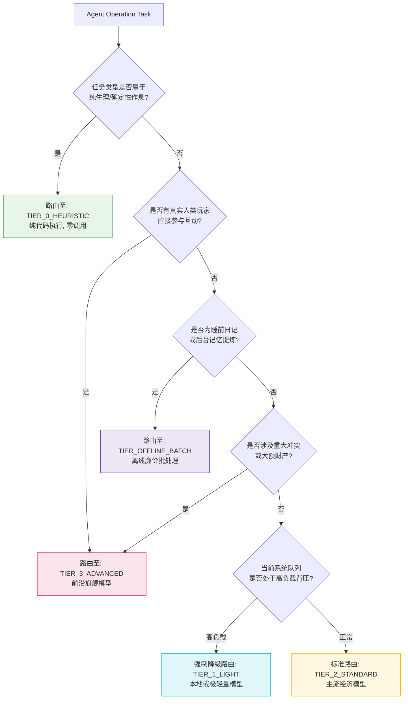

# 13 - 智能模型路由策略与能力分层 (Model Routing Architecture)

> **注**：本文件同时作为 `MODEL_ROUTING.md` 归档。

## 1. 为什么不能将特定商业模型名写死为领域标准？

在许多快速迭代的 AI 项目中，经常在系统架构中硬编码如下代码：

```typescript
// 错误反模式：将特定厂商模型名绑死为系统标准
const model = isImportant ? "gpt-4o" : "gpt-4o-mini";
```

这种做法在工业级长线系统中有严重缺陷：

1. **商业模型生命周期极短**：商业 LLM 版本每 3~6 个月更迭一次，旧版本会被强行下线（Deprecate），导致代码过时失效。
2. **定价与延迟波动剧烈**：不同厂商的定价与限流策略频繁调整，写死模型名使系统失去套利与迁移能力。
3. **无法适配边缘计算与本地模型**：无法在离线开发、私有化机房或高安全性集群中透明切换到开源本地模型。

因此，镜界确立：

> **镜界领域契约与业务逻辑只面向“能力层级（Capability Tiers）”，不面向任何特定商业模型名称！**
> **模型路由器（ModelRouter）根据任务类型、上下文长度、延迟预算与实时价格，动态将能力层级映射到具体的物理模型。**

---

## 2. 四大能力层级划分规范 (Capability Tiers)

```text
┌────────────────────────────────────────────────────────────────────────┐
│ TIER_0_HEURISTIC (零模型启发式层)                                       │
│ - 算力形态: 本地 TypeScript 纯函数、行为树、效用评分矩阵                │
│ - 适用任务: 生理状态机流转、A* 空间寻路、固定日程上下班、模板招呼语句 │
├────────────────────────────────────────────────────────────────────────┤
│ TIER_1_LIGHT (轻量级敏捷小模型层)                                      │
│ - 参数规模: 3B ~ 8B 本地模型, 或云端超快轻量模型 (Flash-Lite / Haiku)   │
│ - 核心优势: 首字延迟 < 300ms, 极低成本, 高并发吞吐                      │
│ - 适用任务: 简单意图分类、短句闲聊打招呼、简单物品选择、情绪标签标注    │
├────────────────────────────────────────────────────────────────────────┤
│ TIER_2_STANDARD (标准级全功能模型层)                                   │
│ - 参数规模: 14B ~ 70B 开源模型, 或云端主力模型 (Gemini Flash / GPT-4o-mini)│
│ - 核心优势: 良好的结构化 JSON 输出可靠性、稳健的角色扮演一致性          │
│ - 适用任务: 邻里非极端多轮社交、偶发商业议价、复杂日常计划调整         │
├────────────────────────────────────────────────────────────────────────┤
│ TIER_3_ADVANCED (旗舰级深度推理模型层)                                 │
│ - 参数规模: 前沿旗舰级大模型 (Claude Sonnet / GPT-4o / Qwen-Max / DeepSeek) │
│ - 核心优势: 极高智力、长因果链逻辑推演、复杂伦理抉择、人类玩家互动    │
│ - 适用任务: 人机面对面多轮对话、重大法庭抗辩、破产重组战略谈判          │
├────────────────────────────────────────────────────────────────────────┤
│ TIER_OFFLINE_BATCH (后台离线批处理层)                                  │
│ - 算力形态: 夜间吞吐型模型或长上下文廉价通道 (Batch API)                │
│ - 适用任务: 睡前日记沉淀、记忆聚合反思 (Memory Reflection)、声誉重算   │
└────────────────────────────────────────────────────────────────────────┘
```

---

## 3. 动态路由裁决流程 (Dynamic Routing Pipeline)

当 Agent Worker 接收到认知操作任务时，路由器通过如下规则链进行物理模型分派：



---

## 4. 本地开源模型与云端模型协同架构 (Hybrid Cloud & Local Topology)

为兼顾商业成本可控与高保真沉浸体验，镜界确立**云端前沿 + 本地端侧混合拓扑（Hybrid Model Topology）**：

| 能力层级                 | 推荐云端提供商映射 (Cloud Mapping) | 推荐本地/私有化映射 (Local Mapping)           | 选用权衡理由                                       |
| :----------------------- | :--------------------------------- | :-------------------------------------------- | :------------------------------------------------- |
| **`TIER_1_LIGHT`**       | Gemini Flash Lite / Claude Haiku   | Ollama / vLLM 运行 **Qwen2.5-7B-Instruct**    | 极高并发日常背景对话，本地部署可做到 $0 Token 成本 |
| **`TIER_2_STANDARD`**    | Gemini Flash / GPT-4o-mini         | vLLM 运行 **Qwen2.5-14B / Llama-3.1-8B**      | 结构化输出可靠，能够严格遵守 JSON Schema 契约      |
| **`TIER_3_ADVANCED`**    | Claude 3.5 Sonnet / GPT-4o         | vLLM 运行 **DeepSeek-R1 / Qwen-72B** (需集群) | 复杂长链思考与玩家深度交互，保障对话文学感与策略性 |
| **`TIER_OFFLINE_BATCH`** | Cloud Batch API (50% 折扣)         | 本地离线闲时算力 (凌晨按序消化)               | 异步任务对延迟完全不敏感，最大化压榨成本效益       |
