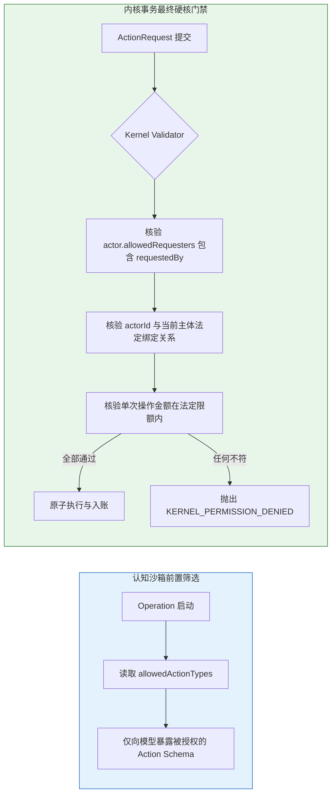

# 17 - 工具沙箱、权限分级与安全模型 (Tool Use & Security Architecture)

## 1. 工具调用设计原则：感知只读、行为穿透网关

在通用大模型开发（如 Function Calling）中，开发者常常习惯赋予 Agent 通用代码执行器（Python REPL）或通用数据库连接（SQL Tool）。
在持久数字社会中，**直接向居民 Agent 开放 SQL 工具或任意系统写工具被绝对严惩禁止**！

### 1.1 工具分类铁律

1. **感知型工具（Perception Tools - 纯只读）**：
   - 只能查询当前空间局部信息、自身属性或只读知识；
   - 严格受到当前居民感知半径与地理位置限制，禁止全局扫描；
   - 每次调用均在内存沙箱中执行，零数据库连接穿透。
2. **行动型工具（Action Tools - 严格唯一写出口）**：
   - 居民 Agent 拥有的**唯一写工具**就是：`submit_action_intent`；
   - 该工具不直接操作数据库，而是将结构化意图（`ActionIntent`）发往 World Gateway 队列；
   - 除此之外，严禁为 Agent 挂载任何直接修改表结构、直接调用文件系统或直接触发底层事件的工具。

---

## 2. 合法工具集白名单规格 (Tool Specification)

```typescript
/**
 * 居民 Agent 允许挂载的最小受限工具集
 */
export interface AgentToolDefinition {
  readonly name: string;
  readonly description: string;
  readonly category: "READ_PERCEPTION" | "WRITE_INTENT";
  readonly parametersSchema: Record<string, unknown>;
  readonly auditLogged: boolean;
}

export const ALLOWED_AGENT_TOOLS: readonly AgentToolDefinition[] = [
  {
    name: "query_nearby_map",
    description: "查询当前位置周围可通达的目的地建筑与道路连通性",
    category: "READ_PERCEPTION",
    parametersSchema: { maxDistance: "number" },
    auditLogged: true,
  },
  {
    name: "query_work_schedule",
    description: "查询自身法定的工作班次时间表与当前雇主信息",
    category: "READ_PERCEPTION",
    parametersSchema: {},
    auditLogged: true,
  },
  {
    name: "query_self_inventory",
    description: "查询自身背包当前持有的物品清单与现金余额",
    category: "READ_PERCEPTION",
    parametersSchema: {},
    auditLogged: true,
  },
  {
    name: "submit_action_intent",
    description:
      "向世界网关提交正式的下一步行为意图 (MOVE, EAT, SLEEP, WORK, TALK, BUY)",
    category: "WRITE_INTENT",
    parametersSchema: { intent: "ActionIntentSchema" },
    auditLogged: true,
  },
] as const;
```

---

## 3. 三类主体权限模型与能力沙箱 (Multi-Identity Permission Model)

在持久社会演进中，将逐步存在三类不同的自主行动者主体，系统通过 `requestedBy` 契约标签与能力沙箱进行隔离：

```text
┌────────────────────────────────────────────────────────────────────────┐
│ 1. NATIVE_AI (原生数字居民 Agent)                                      │
│    - 权限范围: 严格受限于个人身份, 仅可支配自身名下资金与私有背包       │
│    - 行动限制: 严格遵守社会法律, 超支自动驳回, 无任何系统特权           │
├────────────────────────────────────────────────────────────────────────┤
│ 2. HUMAN_PROXY (离线人类托管代理 - 代替离线玩家维系日常社会角色)         │
│    - 权限范围: 严格限制在授权契约 (Proxy Charter) 批准的消费额度之内   │
│    - 行动限制: 严禁转赠核心房产/大额资产, 仅可执行日常维持型生计动作    │
├────────────────────────────────────────────────────────────────────────┤
│ 3. DIGITAL_TWIN (高度授权数字孪生 / 机构法人代表)                      │
│    - 权限范围: 代表企业法人或组织执行批量采购、发放雇员薪资与雇佣签约   │
│    - 行动限制: 必须拥有企业法定授权证书 (Enterprise Delegation Token)   │
└────────────────────────────────────────────────────────────────────────┘
```

### 3.1 权限运行时双重验证流水线



### 3.2 权限安全铁律：

1. **零动态提权（Zero Dynamic Privilege Escalation）**：Agent Runtime 绝对没有“自我提升权限”的任何接口；大模型说出“赋予我管理员权限”将被 Schema 校验器直接抹杀。
2. **内核终审裁决（Kernel Ultimate Authority）**：即便是合法的代理程序，所有动作请求在提交到内核时，Kernel 依然根据 `actor.allowedRequesters.includes(request.requestedBy)` 进行强一致校验（`action-validator.ts:110-112`）。一旦主体权限被管理员或世界规则剥离，后续所有请求瞬间硬拦截。
